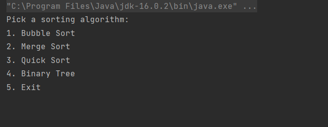

# Sort Manager Application

This application was created with the aim of enabling the user to experiment with a variety of sorting algorithms and also serves as a foray into several design patterns (MVC, Factory, Singleton etc..). There are two applications in this repository, a console application with support for Bubble Sort, Quick Sort, Merge Sort and Binary Tree.

The GUI application implements these sorting algorithms and more.

# Table of Contents
1. [Console Application](#console_app)
2. [GUI](#GUI)
    1. [Benchmarking](#Benchmarking)
    2. [Logging](#logging)
3. [Unit Tests](#unit_test)
4. [Setup Guide](#setup_guide)
5. [Acknowledgements](#Acknowledgements)


## Features

- [x]  Quick Sort
- [x]  Bubble Sort
- [x]  Merge Sort
- [x]  Binary Tree
- [x]  Insertion Sort
- [x]  Selection Sort
- [x]  Arrays.sort()
- [x]  Parallel Sort
- [x]  Collection Sort

- [x]  MVC Design Pattern
- [x]  Maven dependency management
- [x]  SOLID Principles applied
- [x]  Random array generator
- [x]  Logging
- [x]  Unit Tests
- [x]  GUI

## 1. Console Application <a name="console_app"></a>

The console application be accessed from the `ConsoleApp` class by running the classes main method. Once run an application like the figure below should appear in the terminal.



Sorting algorithms in the console app

Once an algorithm is selected the user can specify how many numbers they would like in the randomly generated array.


The sort is run the results are printed to the console.

## 2. GUI <a name="GUI"></a>

Users seeking a more modern interface can use the GUI by running the `JavaFxApp` class. As implied by the class name the GUI was developed in JavaFx using the SceneBuilder GUI development tool.


Once unique feature of the GUI compared to the console application is the ability to select multiple sorting algorithm and filter the results table for easier algorithm comparison.

### 2.1 Benchmarking <a name="Benchmarking"></a>

The sorting algorithms implemented have various strengths and weaknesses. In order to better understand the performance of each approach, the GUI supports a benchmarking feature. This allows the users to select multiple algorithms and benchmark it.

```java
//will generate random arrays of the following lengths for the benchmark
int[] benchmarkLengths = {5, 14, 22, 37, 56, 72 , 88, 100, 111, 120};
```

To do this the program generates 10 arrays of varying sizes and runs each algorithm against all ten arrays and records the average sorting time.


Benchmarking some algorithms

### 2.2 Logging <a name="logging"></a>

All good applications need a robust set of logs to aid debugging. The system logs tab of the GUI shows all the logs recorded by the application. The logs can be sorted by severity, time and source package to name a few.


## 3. Unit Tests <a name="unit_test"></a>

Unit tests were created for the vast majority of classes in this application. These tests enabled me to ensure code behaviour as required and also to examine the systems behaviour to edge cases and fix any test case failures in a time fashion. Finally the tests serve as a living document for the program that will aid third parties looking at the code in understanding it better.


Passed all test cases

## 4. Setup Guide <a name="setup_guide"></a>

To run the application the repository can be downloaded from GitHub as a zip file or using a Git command. The code can then be imported into IntelliJ as a new project.

Running the `ConsoleApp` class will produce the terminal sorting program and `JavaFxApp` will produce the GUI.

## 5. Acknowledgements <a name="Acknowledgements"></a>

- Want to take moment to thank my trainers Neil and Cathy for the help and support in putting this project together.
- Would also like to thank my colleagues in Engineering 95 & 96 for all the debugging assistance.
